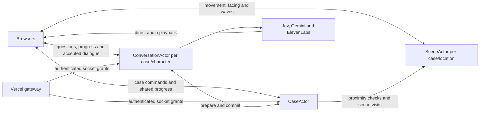
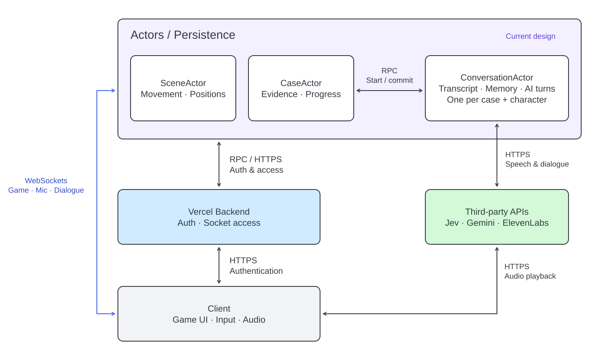

# Multiplayer architecture

The actor runtime is **durable-actors 0.7.16**, accessed through **terse-sdk 0.9.15**. Local development starts the published runtime; the generated client also supports the managed Terse Cloud endpoint. Hosted play uses a public Vercel frontend and Express gateway connected exclusively to cloud actors. See [deployment](deployment.md) for the tested package and commands.

[Edit the architecture diagram in Excalidraw](conversation-architecture.excalidraw).

## Source boundaries

`frontend/src/` owns React, Three.js, browser storage, and audio playback. `frontend/public/` contains shared interface assets. Vercel serves registered story assets from its CDN; the local gateway serves the same assets from the selected package. The browser sends gameplay commands and receives public case views directly through a Terse actor WebSocket. The gateway handles case creation and socket authorization.

`backend/src/` owns the Express gateway, case services, authored story outcomes, and the actor entrypoint at `backend/src/durable-objects.ts`. Actor definitions use `terse-sdk/actor`; gateway calls and socket grants use the generated Terse client. Local launchers pass the entrypoint explicitly. The cloud package supplies `src/actor.ts` and embeds its validated story data in the actor bundle.

`shared/game/` holds the contracts and game rules needed on both sides, including navigation and speech timing. It compiles without browser or Node globals. Frontend and backend can import shared code; shared code cannot import either application. `tests/architecture.test.ts` checks the resolved TypeScript dependency graphs, including type-only imports, to enforce these directions. Vite's filesystem allowlist covers frontend, shared, and installed dependencies.

## Authority and coordination

`CaseActor` owns the investigation: membership, scene visits, activity, evidence, object observations, witness leases, testimony, deductions, progression and reports. It authorizes a dialogue turn and supplies eligible context, then validates that context again when the accepted reply commits. A reply and its evidence commit in the same invocation. Case records retain facts and recent replies needed by game rules; the full conversation archive belongs to ConversationActor. Models cannot create evidence or change item locations.

`ConversationActor` owns one conversation per case and stable character `entityId`, shared across appearances and both detectives. Its SQLite database stores accepted exchanges, per-investigator relationship standing and pending generation checkpoints. Scope, authorized member hashes and the public revision are persisted actor fields. History is paginated; models receive the latest 24 exchanges plus the accumulated relationship standing. Private context, drafts and provider jobs are never broadcast.

`SceneActor` owns positions, movement and waves for one case/location. Browsers send movement directly to it, keeping frequent position updates out of the investigation's persistence and broadcasts. The case keeps a last-read position for presentation, while interaction checks use current scene positions. Opening an interview performs one scene call that validates proximity and locks movement. Object inspection reads the current scene once, including a partner's position for joint inspections. Testimony, notes, deductions and repeated completed commands make no scene calls. Idle case heartbeats are local; a heartbeat during an interview renews the scene's movement lock as well as the local witness lease.

Travel records the new location and visit number in the case before making scene calls. The next snapshot, socket grant or interaction applies the saved handoff: leave the old scene, then configure and enter the destination in one scene invocation. Retrying entry for the same visit preserves movement already made there. Visit numbers reject old grants after the handoff, and stage epochs prevent an old configuration replacing a newer one. Interview locks are an expiring scene projection of the case's lease, repaired on reconnect; they expire after 90 seconds without renewal.

Storage version 5 starts fresh games. Case addresses are `case--v5--<invitation-id>`; scene addresses are `<locationId>--<hash>`, with the full SHA-256 suffix covering storage version, case and location. The browser uses `investigation.v5.<storyId>.<storyVersion>.*` session keys. Conversation addresses are `conversation--<hash>`, with the same version, case and stable identity inputs. Story version remains independent of engine storage version. Old saves and addresses are not read or migrated. The pinned runtime accepts `--` in actor IDs but rejects `~`.

`InterviewCoordinator` runs inside ConversationActor. Interleaved generation lets other socket messages and short self-RPCs run while a provider is working. Each successful self-RPC persists a meaningful stage checkpoint, without waiting for the long generation invocation to finish. Dialogue generation makes two CaseActor calls: prepare and commit. A spoken input adds one ownership check before transcription. Neither model tokens nor audio chunks require case coordination.

Jev receives only currently eligible factual disclosures. Gemini Flash receives the selected facts, personality, background, goals, actual player message and recent conversation. A response contains only the witness's own words. Jev checks grounding and tracks the eligible facts actually communicated. Facts accumulate across replies and both detectives for the same NPC appearance; evidence is awarded when its complete account has been stated; a failed response is regenerated once, then rejected without a scripted fallback. Small talk and follow-ups remain available after successful disclosures.

ElevenLabs Scribe v2 through fal handles microphone transcription. A voice activity detector in the browser ends each turn when the player stops speaking, or when they release hold to talk, then uploads a mono 16 kHz PCM16 WAV recording. The client sends bounded base64 chunks on its authenticated ConversationActor socket. ConversationActor validates format and duration, checks ownership with CaseActor, then calls fal using its server-held key. Raw audio is kept only in ephemeral memory, scoped to the player and socket, and is discarded on completion, cancellation or disconnect. Incomplete uploads expire; a dropped upload asks the player to speak again. Only finalized speech text enters the ordinary conversation action; the canonical transcript persists with the reply. The mic stays open for the conversation, pauses while the character replies and closes when the conversation ends. ElevenLabs through fal also supplies character output audio; the Gemini Flash dialogue model runs through fal’s OpenRouter chat-completions endpoint using the same fal key. Jev remains on TypeSafe for decisions and validation; no direct OpenAI API credential is required.

Speech-provider request IDs and per-line completion metadata are saved in the conversation's pending draft. Generation ownership renews every twenty seconds; concurrent voice checkpoints are serialized. A reconnect heartbeat resumes saved work after any previous claim expires. Completed stages are reused, and a lost case commit acknowledgement is retried idempotently. There is no independent background scheduler. A crash between provider acceptance and saving its request ID may repeat that provider request; accepted transcript entries and evidence remain deduplicated.

## Sessions and live state

The browser receives a random room identifier, a player identifier, and a secret. The actor saves a SHA-256 hash of the secret. Every game action authenticates membership. A case persists its mode at creation: co-op accepts two players and solo accepts one. The invitation grants the ability to occupy an empty co-op place; returning players retain credentials in browser storage. Reports, cutscenes and joint inspections use the saved mode, never a temporary connection count.

The gateway authorizes separate `POST /api/cases/:roomId/socket`, `/scene-socket` and `/conversation-socket` grants. Case sockets carry `update` and correlated `result` messages, scene sockets carry positions, and conversation sockets carry bounded transcript snapshots, stage progress and accepted reply/audio references. Grants bind player credentials and the scene visit or character appearance. Each actor has its own revision. Private state is absent from public socket contracts; Terse credentials remain server-side. The pinned SDK uses JSON RPC over HTTPS between servers, not gRPC.

The browser sends live questions directly to ConversationActor. The HTTP question endpoint also forwards to that actor and does no generation itself. Case changes still broadcast to both players. A generated recording is created once and shared through the same provider audio URL; each client plays it locally. Nearby partners can listen unless muted or occupied in another conversation. Playback uses the shared speech timeline, without sample-perfect synchronization. Microphone data goes directly to ConversationActor; playback bytes go directly from fal media to each browser. Vercel has no microphone or voice-proxy route.

Commands validate chapter, location, evidence possession, and conversation ownership on the server. Recent command IDs are deduplicated. Movement is bounded and speed-limited. Movement commands authenticate and broadcast positions without querying the connection inventory; membership-sensitive actions still refresh it. It is cooperative movement, not a competitive anticheat or full authoritative physics system. Heartbeats renew conversation leases. Disconnecting preserves pending generation; conversation socket heartbeats resume it after any previous worker claim expires. Explicitly ending or leaving a conversation cancels pending turns. Ordinary disconnected conversations release their lease, with a 90-second expiry for abandoned sessions.

The browser obtains a fresh grant after a disconnect; the actor sends a saved snapshot on connection. In-flight requests fail clearly and are not automatically replayed after an ambiguous disconnect. Revisions prevent an older update from replacing newer state. Position messages omit the large evidence archive.

Local walking updates Three.js transforms directly without scheduling React state updates each frame. Partner movement buffers 150–350 ms according to recent arrival intervals. Its playback clock adjusts gradually, and it predicts at most 150 ms beyond the last update at no more than walking speed. Late corrections blend back to the received position; explicit stops settle at that position, and large travel jumps reset the buffer. Prediction affects only presentation, never the server's interaction checks.

All three actor types request a five-second idle timeout through `@Compute`. After activity stops and handlers finish, the runtime can evict them; the next invocation restores saved state. Open WebSockets remain at the gateway. The browser's 20-second heartbeats can wake dormant actors between interactions. Only live conversations activate ConversationActor, and no game loop keeps empty scenes alive.

## Local persistence

The dev runtime uses SQLite and local actor storage under `.durable-actors/`. That directory is ignored by Git and contains private runtime credentials. The launcher uses `startLocalActors`, generates a local API key and passes the returned connection settings to the gateway. It restarts the runtime, gateway and Vite together. Copying only source files to another computer does not copy a saved case.

Generated speech is not saved to application disk or object storage. ConversationActor validates the fal URL and audio duration, then saves the provider URL, text and duration with the accepted reply. Both clients play the same URL directly. Only HTTPS `fal.media` hosts are accepted. Provider retention determines how long recordings remain playable; older dialogue stays readable if a recording disappears. No shared audio signing key is required. A crash after a provider accepts a request but before its ID is checkpointed can repeat that request; committed testimony and evidence remain deduplicated.

## Hosted application

Vercel serves the built frontend and registered story assets without a website password or sign-in cookie. Story and health endpoints are public. Case reads, actions and socket grants still require the player's identifier and Bearer credential, with membership enforced by the actors. Provider keys and the Terse API token remain server-only.

The API is a Node.js Function with a 360-second limit. It creates player-scoped Terse WebSocket grants; browsers send gameplay directly to the granted actor socket. Gemini Flash uses `medium` reasoning by default with 32,768 completion tokens and a 120-second provider timeout. AI generation can retry validation once, so the browser allows six minutes for an interview action. Extra reasoning can increase response time; it does not block the case actor.

The Terse deployment contains CaseActor, SceneActor and ConversationActor, including the dialogue and speech provider dependencies. No CaseRoom, legacy gameplay adapter or migration endpoint is deployed. Source changes require `terse deploy` from the prepared actor project. Vercel and Terse must use the same story and storage versions. Local saves, credentials, authoring files and provider keys are excluded from the website upload.

Current limits include same-browser recovery only, no partner replacement, no built-in voice chat, no public lobby, and no automatic case expiration. Rate limiting is per gateway instance. No public-scale load or cloud-backup restoration claim is made. Saved cases reject mismatched story IDs and versions; there are no runtime content migrations.

## Story selection

`backend/src/active-story.ts` selects one package through `STORY_PATH`. `story-loader.ts` validates its schema, references, geography and asset files before startup. Shared story types and validators have no dependency on a particular campaign. The HTTP presentation omits answer definitions; the case authority sends discoveries and revealed prompts. Both gateway and actor runtime must use the same package. See [the authoring guide](story-authoring.md).
